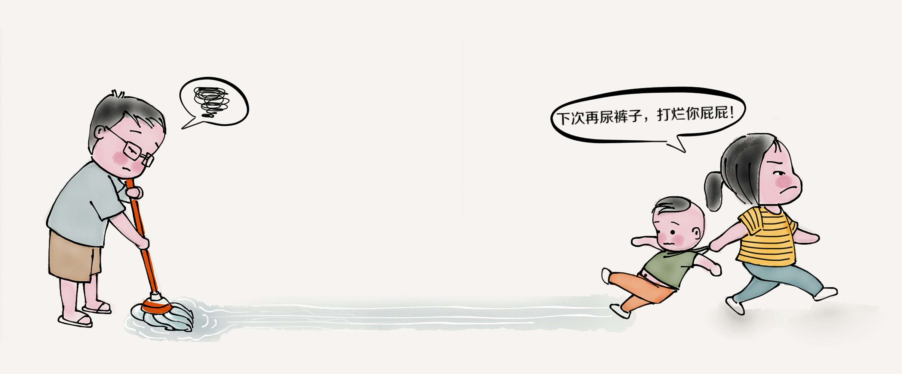

考证。
这个对你以后的工作也会有很大帮助的。计算机二级、英语四六级、普通话证、教师资格证……等等，只要你觉得有可能用的上的证你就可以去考，只要复习充足，一次考过不是问题！这个要查阅学校规范，哪一年级开始可以考什么证都要铭记于心，以便之后报名
大学生如何规划自己的四年生活
多去图书馆。
博览群书应该是每个好学学子的愿望吧！大学的图书馆就可以给你这个机会，不管是在那里看书还是借回宿舍翻看，图书馆的大门都会为你敞开的
大学生如何规划自己的四年生活
与专业老师、辅导员搞好关系。
大学里学生与老师之间的关系没有初高中那么紧密，大多数学生四年有可能才见过十来次辅导员。但这并不代表他们不重要，如果你和他们打好关系，在某些事情上他们是可以给你提供更有效、更全面的信息的，这点特别重要
大学生如何规划自己的四年生活
经常进行体育锻炼。
即使不为了健美的身材，为了你自己的身体健康，一个月也要跑几次长跑。大学生的体质普遍下降，但有一个好身体是生活、学习、工作的基础。所以各位一定要坚持锻炼
大学生如何规划自己的四年生活
与舍友搞好关系。
大学里最亲密的就是舍友情了。其他同学一年就上课时间见几次，而舍友则是要朝夕相处的，要是关系不好会很尴尬的。如果你不能跟所有室友搞好关系，最起码要搞定一个，这样你平常吃饭，打水，洗澡才不会觉得孤单。
大学生如何规划自己的四年生活
学好专业课。
大学不挂科是基本要求，如果你不思进取不准备拿奖学金，那你混日子也可以，但这是建立在你专业课成绩良好的基础上。你去找工作，人家要考察的就是你的专业技能！
大学生如何规划自己的四年生活
有空实习就找地方实习。
实习经验对你来说是最宝贵的财富，有了这个你就可以在面试场上傲视群雄！这个并没有夸张，一个来给我们传授经验的hr说他们招聘最看中的就是工作经验，一份知名企业的实习经历可以抵过你的考试的非正常发挥
大学生如何规划自己的四年生活

